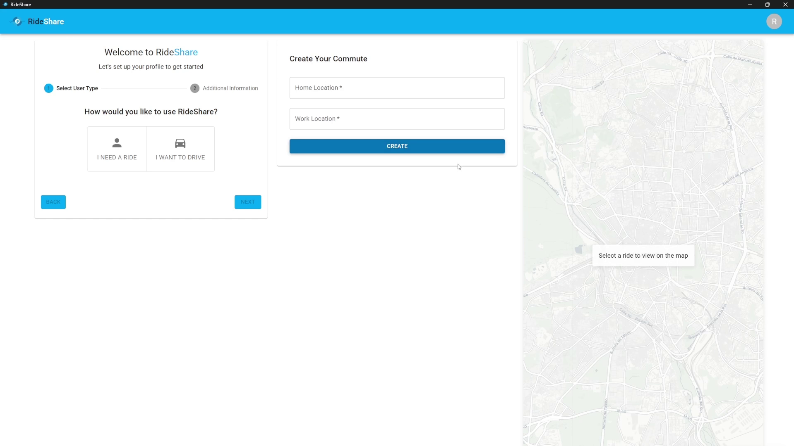

# RideShare 🚗💨

**RideShare is an innovative carpooling app designed to seamlessly match riders with drivers for their daily commutes, optimizing routes and minimizing walking distances.**

---

## Table of Contents
1.  [Overview](#overview)
2.  [Key Features](#key-features)
3.  [Purpose & Motivation](#purpose--motivation)
4.  [Tech Stack](#tech-stack)
5.  [Architecture](#architecture)
6.  [Challenges & Learning](#challenges--learning)
7.  [Future Development](#future-development)
8.  [Acknowledgements](#acknowledgements)

---

## Overview
RideShare allows users to register as either a **rider** or a **driver**. By setting their home and work locations, the app intelligently matches riders with drivers whose existing commute routes align. The core objective is to make carpooling convenient by minimizing the walking distance for riders.

Users can personalize their experience with options such as:
* Setting a maximum preferred walking distance.
* Specifying their commuting days.
* (Considered Feature) A gender filter to enhance user comfort and safety.

---

## Key Features
* **User Registration:** Separate registration flows for riders and drivers.
* **Location Setup:** Define home and work locations for commute matching.
* **Intelligent Matching:** Algorithm to connect riders with relevant drivers.
* **Route Optimization:** Aims to find routes that benefit both driver and rider.
* **Walking Distance Minimization:** Focuses on reducing rider's walk to pickup/from drop-off.
* **Personalization:** Customizable commuting days and maximum walking distance.
* **Real-time Notifications:** (Implied by Firebase usage) For match updates, etc.
* **Authentication:** Secure user login and management.

---

## Purpose & Motivation
The primary motivation behind RideShare was to develop a project with **sustainability** at its core. Transportation is a significant contributor to pollution, and RideShare offers a practical way to make a positive impact by encouraging shared rides. 🌱

Simultaneously, this project presented an opportunity to tackle complex **optimization problems**, particularly those involving geographical data which introduces unique challenges concerning precision and resolution.

---

## Tech Stack

### Frontend
* **React:** For building the user interface.
* **Firebase:**
    * Authentication: Secure user login and management.
    * Notifications: Real-time updates for users.
    * Deployment: Hosting the frontend application.

### Backend
* **Python (FastAPI):** Framework for building efficient APIs for microservices.
* **Microservices Architecture:** Backend functionalities are broken down into smaller, independent services.
* **API Gateway:** Manages requests between the client and the microservices.
* **Docker:** For containerizing the backend services.
* **Kubernetes:** For orchestrating and managing the containerized microservices.

---

## Architecture
The application follows a **client-server architecture**.
* The **Frontend** (React app) serves as the client, interacting with the user.
* The **Backend** is composed of several **Python (FastAPI) microservices**, containerized with Docker and orchestrated by Kubernetes. These services handle the core logic, data processing, and matching algorithms, all exposed through an API Gateway.

---

## Challenges & Learning
A significant personal challenge undertaken in this project was the implementation of **Kubernetes** for managing microservices. While arguably **overengineering** for the initial scope, this decision was made to deepen my understanding of complex system orchestration.

The main hurdle was managing the operational overhead introduced by a microservices architecture while ensuring timely delivery of core application features. This experience underscored the importance of meticulous planning, understanding system trade-offs, and maintaining focus on project goals.

A key takeaway has been understanding the practical applications and limitations of generative AI in large-scale projects. While invaluable as tools, they shouldn't define the ceiling of one's own skills. True project ownership and deep dives into the technology are irreplaceable.

---

## Future Development
Currently, there are no immediate plans for further development of RideShare. Monetizing such a platform presents its own set of challenges, which was not the primary focus of this academic project.

However, the project could be revisited if a compelling opportunity arises, particularly one that aligns with its sustainability mission, or if a sponsor expresses interest in supporting its continued evolution. 🚀

---

## Acknowledgements
Special thanks to **Professor Solomon Shifferaw** for his invaluable guidance, mentorship, and support throughout the development of this project.

---
